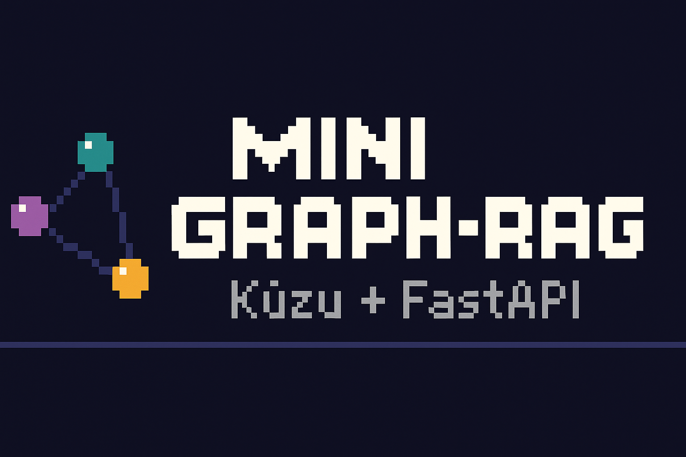

<p align="center">
  
</p>

# Mini Graph-RAG (Kùzu + FastAPI)

[](https://github.com/magnusseptim/mini-graph-rag/actions/workflows/ci.yml)


Tiny, teachable Graph-RAG starter that stores a `Document → Section → Chunk` graph in
the embedded **Kùzu** database and exposes simple endpoints for seeding, ingesting,
and listing chunks.

## Why this exists
- **Embedded DB**: no server to run; just `pip/uv` and go.
- **Clean graph shape**: `Document -[:ContainsDocSection]-> Section -[:ContainsSectionChunk]-> Chunk`
- **Idempotent seed** and **safe ingest** (409 on duplicate titles).

## Quickstart

### Docker (one-liner)

```bash
make docker-build
make docker-run
# In another terminal:
curl -s http://127.0.0.1:8000/health
make seed
make chunks
make seed-emb
make semantic

```

### Make targets
- `make run` — start FastAPI (reload on code; ignores DB dir)
- `make seed` — seed sample data
- `make chunks` — list chunks
- `make ingest` — demo ingest request
- `make indexes` — debug vector indexes
- `make seed-emb` — call the debug helper to populate deterministic embeddings
- `make semantic` — run a simple semantic search with a one-hot query vector (index 0)
- `make test` — run pytest via uv
- `make clean-db` — delete local Kùzu artifacts (WAL/DB)

### 60-second flow

```bash
make run         # start the API (keep this running)
make seed        # create Sample Doc with sections/chunks
make chunks      # sanity check: expect count > 0
make seed-emb    # write dummy one-hot embeddings (dev only)
make semantic    # query nearest chunks via HNSW+cosine
```

### Requirements
- Python 3.11+
- [uv](https://github.com/astral-sh/uv)

### Install & run
```bash
uv sync
uv run uvicorn app.api.routes:app --reload --host 0.0.0.0 --port 8000
```

### Dev workflow
```bash
# Install deps (incl. dev)
uv sync --dev

# Run tests (same as CI)
uv run pytest -q

```

## Config (env vars)

- KUZU_DB_PATH (default: ./var/mini-graph-rag.kuzu)
- OTEL_EXPORTER_OTLP_ENDPOINT (optional)
- OLLAMA_URL (placeholder for future vectors; unused today)

## API

| Method | Path | Description |
|------:|------|-------------|
| GET   | `/health` | Health check. |
| POST  | `/seed?reset=true\|false` | Seed sample data (idempotent if `reset=false`). |
| POST  | `/ingest` | Create a document with sections/chunks. Returns **409** if title exists. |
| GET   | `/chunks?doc=<title>&limit=<n>` | List chunks (optionally filter by document). |
| GET   | `/search?q=<text>&doc=<title>&limit=<n>&ci=<bool>` | **Substring search** in `Chunk.text`. `ci=true` (default) is case-insensitive. |
| POST  | `/search/semantic` | **Vector search** via Kùzu HNSW. Body: `{"vector":[...384 floats...], "k":5, "efs":200, "doc":"Title?"}` |
| POST  | `/debug/set_dummy_embeddings` | Dev helper: writes one-hot vectors into `Chunk.embedding` so semantic search works without an external model. |
| GET   | `/debug/indexes` | Lists indexes via `CALL SHOW_INDEXES()`. |

> **Tip:** If `/debug/set_dummy_embeddings` returns `{"updated": 0}`, you probably haven’t seeded yet. Run `make seed` (or `/ingest`) and try again.

> **Tuning:** `/search/semantic` accepts `efs` (beam width). Higher `efs` ⇒ better recall, slower queries. Defaults are fine for the demo.


## Example calls

```bash
# Health
curl -s http://localhost:8000/health

# Seed (fresh)
curl -s -X POST "http://localhost:8000/seed?reset=true" | jq

# List chunks
curl -s "http://localhost:8000/chunks?doc=Sample%20Doc" | jq

# Ingest new doc
curl -s -X POST http://localhost:8000/ingest \
  -H "Content-Type: application/json" \
  -d '{"title":"Kickoff Notes","sections":[
        {"title":"Intro","chunks":["hi","agenda"]},
        {"title":"Body","chunks":["topic A","topic B","Q&A"]}
      ]}' | jq

# Case-insensitive (default)
curl -s "http://127.0.0.1:8000/search?q=topic&doc=Kickoff%20Notes" | jq

# Case-sensitive
curl -s "http://127.0.0.1:8000/search?q=TOPIC&doc=Kickoff%20Notes&ci=false" | jq
```

## Notes
- Row iteration with Kùzu:
  ```python
  while res.has_next():
      row = res.get_next()
  ```

- ```SERIAL``` IDs keep increasing across deletes—normal.

- Reserved words: avoid ```order```; use ord (or backticks).

### Why cosine + HNSW (in one paragraph)

**Cosine** compares the *angle* between embedding vectors, which lines up well with “same meaning” in text embeddings (direction ≈ semantics). **HNSW** builds a multi-layer neighbor graph: a sparse **upper** layer for long jumps and a dense **lower** layer for local refinement. Queries do a greedy walk from top to bottom—fast and high-recall for nearest-neighbor search. For demos, the main knob is **`efs`** on `/search/semantic`: higher values look a bit harder and typically return better matches.


## Troubleshooting

### Stuck at “Waiting for application startup.”?
- Remove local DB artifacts (esp. WAL):  
  `rm -f var/*.kuzu var/*.kuzulog var/*.kuzu.wal var/*.kuzu.tmp`
- Start dev server excluding DB directory from reload:  
  `uv run uvicorn app.api.routes:app --reload --reload-exclude var/* --port 8000`

### Vector update error (stale DB)

If you see:
```markdown
RuntimeError: Runtime exception: Cannot set property vec in table embeddings because it is used in one or more indexes. Try delete and then insert.
```

it usually means a **stale/obsolete local DB** (with an old vector index) is being reused.

**Fix (safe):**
1. Stop the server.
2. Clear local DB artifacts:
```bash
make clean-db
```
(removes var/*.kuzu*, WAL, tmp files)
3. Start again and run, in order:
```bash
make seed
make seed-emb   # writes embeddings, then builds the HNSW index
make semantic
```
4. (Optional) Verify indexes:
```bash
make indexes
```

#### Notes

Ensure KUZU_DB_PATH points to your intended DB file. If you mount a directory in Docker, an old DB in that mount can trigger this.

We intentionally don’t create the vector index at startup; it’s created after embeddings are written (by seed-emb or your real embedder).


## License
[MIT](./LICENSE)